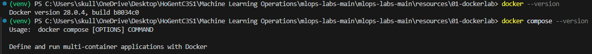
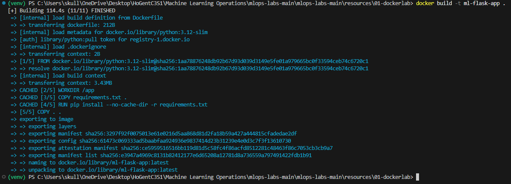
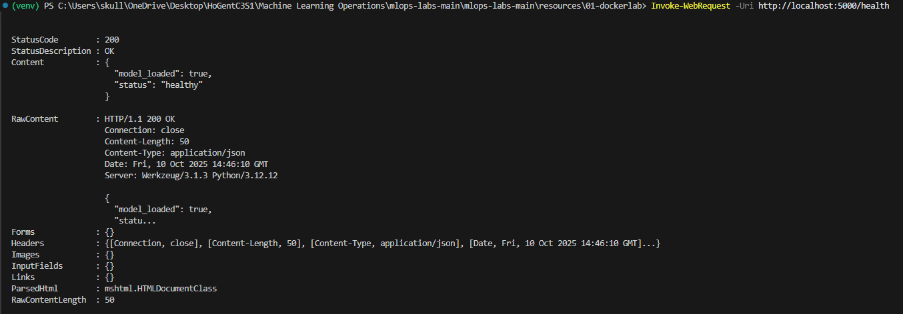
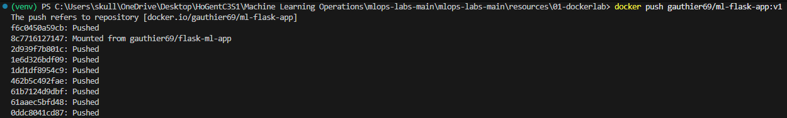
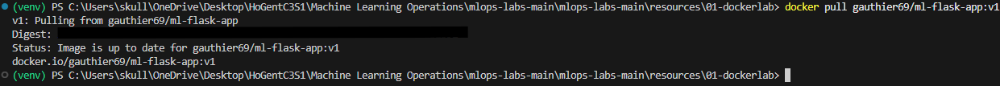
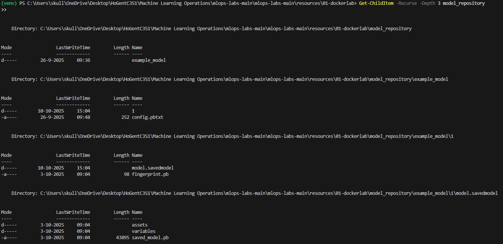

# Lab Rapport: Docker en Triton MLOps

## Student information

- Student naam: Gauthier Vandeputte
- Student code: 202397621

## Assignment description

In dit labo was het de bedoeling om Docker effectief te leren gebruiken binnen een MLOps-context. De taken omvatten het installeren van Docker, het containerizen van een Flask-gebaseerd ML-model, het deployen van modellen met NVIDIA Triton Inference Server, het pushen en pullen van images naar een container registry en het orkestreren van services met Docker Compose.

## Proof of work done

_Voeg hier screenshots, terminal output, codefragmenten en links naar repositories toe._


### Deel 1: Docker Basics in ML Context

| Taak | Bewijs / Screenshot van | Commando / Actie |
|------|------------------------|------------------|
| Docker en Docker Compose geïnstalleerd | Screenshot van terminalversie | `docker --version` + `docker compose --version` |

| Dockerfile aangemaakt voor Flask-model | Screenshot van Dockerfile inhoud | Toon inhoud met `cat Dockerfile` |

| Docker image gebouwd | Terminal output van succesvolle build | `docker build -t ml-flask-app .` (start Docker Desktop op anders werkt dit niet) |

| Container gestart | `docker ps` met draaiende container zichtbaar | `docker run -p 5000:5000 ml-flask-app` |
| Inference uitgevoerd via Flask endpoint | Screenshot Postman / curl output | `Invoke-WebRequest -Uri http://localhost:5000/health` `Invoke-WebRequest -Uri "http://localhost:5000/predict" -Method POST ` `-ContentType "application/json"` ` -Body '{"features": [1.2, 3.4, 5.6, 7.8]}'` |

| Image getagd en gepusht naar registry | Terminaloutput push en tag zichtbaar | `docker tag ml-flask-app gauthier69/ml-flask-app:v1` + `docker push gauthier69/ml-flask-app:v1` |

| Image gepulled en aanwezigheid bevestigd | Screenshot van `docker images` na pull | `docker pull gauthier69/ml-flask-app:v1` |



---

### Deel 2: Triton Serving

| Taak | Bewijs / Screenshot van | Commando / Actie |
|------|------------------------|-----------------|
| Triton-container gestart met TensorFlow-model | `docker ps` met `nvcr.io/nvidia/tritonserver` zichtbaar | ```docker run --gpus all -p 8000:8000 -p 8001:8001 -p 8002:8002 -v "C:\Users\skull\OneDrive\Desktop\HoGentC3S1\Machine Learning Operations\mlops-labs-main\mlops-labs-main\resources\01-dockerlab\model_repository:/models" nvcr.io/nvidia/tritonserver:23.10-py3 tritonserver --model-repository=/models ``` |
| Inference via Triton HTTP endpoint | Output van PowerShell: <br> ```json { "model_name":"example_model", "model_version":"1", "outputs":[{"name":"output_0","datatype":"FP32","shape":[1,1],"data":[0.000029483757316484117]}] } ``` | ```powershell $body='{"inputs":[{"name":"keras_tensor","shape":[1,4],"datatype":"FP32","data":[[1.2,3.4,5.6,7.8]]}]}' Invoke-WebRequest http://localhost:8000/v2/models/example_model/infer -Method POST -ContentType "application/json" -Body $body``` |
| Publiek model gedownload en gebruikt | Screenshot van mapstructuur `model_repository/example_model/1/` | ```powershell wget <model-url>``` of GitHub clone |
| Structuur model repository + `config.pbtxt` toegelicht | Screenshot van `tree model_repository -L 3` en inhoud van `model_repository/example_model/config.pbtxt` | ```Get-ChildItem -Recurse -Depth 3 model_repository``` <br> ```powershell cat model_repository/example_model/config.pbtxt``` |


---

### Deel 3: Docker Compose

| Taak | Bewijs / Screenshot van | Commando / Actie |
|------|------------------------|------------------|
| `docker-compose.yml` aangemaakt | Toon bestand in rapport (codeblok) | `cat docker-compose.yml` |
| Services gestart via Docker Compose | Terminaloutput `docker compose up` en `docker compose ps` | `docker compose up` + `docker compose ps` |
| Logs bekeken | Screenshot met logoutput | `docker compose logs -f` |
| Services gestopt en opgeschoond | Terminaloutput stop/verwijdering | `docker compose down` + eventueel `docker system prune` |

---

### Algemeen

| Taak | Bewijs / Screenshot van | Actie |
|------|------------------------|-------|
| Markdown labrapport in repo | Screenshot GitHub commit | Laat `README.md` / `REPORT.md` zien op GitHub |
| Alle vragen beantwoord | Toon sectie met `:question:` antwoorden | Voeg sectie "Antwoorden op vragen" toe |
| Screenshots van alle belangrijke stappen | Screenshots gelabeld (bijv. `docker_build.png`, `triton_infer.png`) | Upload screenshots in `/docs/screenshots/` map |
| Command cheat sheet bijgewerkt | Toon tabel met alle gebruikte commando’s | Voeg sectie **"Command Cheat Sheet"** toe onderaan |

### vragen
### Lab Questions and Answers

# Answers written as a student (questions blijven in het Engels)

---

## 1. **Why is reproducibility crucial in MLOps? Think about a scenario where your model works perfectly on your laptop but fails in production. What could be the causes?**  
Als iedereen in een andere omgeving werkt (andere Python-versie, andere dependencies, ander OS), dan kan een model lokaal perfect draaien maar compleet falen in productie. Reproduceerbaarheid zorgt ervoor dat de setup overal identiek is, zodat zulke verrassingen vermeden worden.

---

## 2. **What does the `python -m venv venv` command do? What is the meaning of the first `venv` argument, and what of the second? Which of the two can you change to your liking?**  
Dit commando maakt een virtuele Python-omgeving. De eerste venv is de module die dat kan aanmaken. De tweede venv is gewoon de naam van de map. Alleen die tweede mag je zelf aanpassen.

---

## 3. **Make sure your virtual environment is not tracked by Git. How do you do this?**  
Door venv/ in .gitignore te zetten. Dan wordt de virtuele omgeving niet meegestuurd naar GitHub.

---

## 4. **Where are the dependencies installed?**  
Alles wordt geïnstalleerd in de venv/ map van de virtuele omgeving in plaats van op je systeem zelf.

---

## 5. **Why do we copy `requirements.txt` before copying the application code? How does this improve Docker layer caching?**  
Door eerst requirements.txt te kopiëren en dependencies te installeren, kan Docker die laag cachen. Bij een codewijziging hoeft hij dan niet opnieuw alles te installeren, wat veel tijd bespaart.

---

## 6. **What is the difference between `python:3.12` and `python:3.12-slim`? What are the trade-offs?**  
3.12-slim is een kleinere image. Die start sneller, maar bevat minder tools, waardoor je soms extra packages handmatig moet installeren.

---

## 7. **What does the `-t` flag do in the `docker build` command? Why is it useful to tag your images?**  
Met -t geef je je image een naam en versie. Dat maakt het veel duidelijker dan werken met random IDs.

---

## 8. **What does the `-p 5000:5000` flag do? What would happen if you used `-p 8080:5000` instead?**  
Dit maakt poort 5000 van de container bereikbaar via poort 5000 op je host. Met -p 8080:5000 zou je naar localhost:8080 moeten surfen.

---

## 9. **What happens if you try to run the container without the `-p` flag? Can you still access the API?**  
Zonder poortmapping draait de API wel, maar je geraakt er niet aan via je browser of terminal vanaf de host.

---

## 10. **Run `docker images` after building. What information does this show you about your image?**  
Je krijgt de naam, tag, ID, grootte en wanneer de image gebouwd is.

---

## 11. **Use `docker ps` to see running containers. What additional information would `docker ps -a` show you?**  
docker ps toont enkel draaiende containers. docker ps -a toont ook containers die gestopt zijn.

---

## 12. **What is the purpose of tagging an image before pushing? What naming conventions should you follow for production images?**  
Tagging helpt met versies beheren. Voor productie gebruik je best iets als username/project:v1.0.0 zodat je altijd weet welke versie draait.

---

## 13. **What are the benefits of using container registries? How do they fit into a CI/CD pipeline?**  
Registries bewaren je images centraal en CI/CD kan daar automatisch de juiste image ophalen tijdens deployment.

---

## 14. **Why is the model stored in a folder named `1`? What does this number represent?**  
Die 1 is gewoon de versie van het model. Triton gebruikt die nummering automatisch voor versiebeheer.

---

## 15. **What is the purpose of the `config.pbtxt` file? Why is it essential for Triton to understand how to serve your model?**  
In config.pbtxt staat hoe het model inputs en outputs verwacht. Zonder dat weet Triton niet hoe hij het model moet aansturen.

---

## 16. **Analyze the `config.pbtxt` file. What does each field represent?**  
- name: hoe Triton het model noemt  
- platform: op welk framework het model draait  
- max_batch_size: hoeveel requests tegelijk mag  
- input / output: naam, datatype en dimensies van de tensors

---

## 17. **What is the purpose of the volume mapping (`-v` option)?**  
Met volume mapping koppel je een map van je computer aan een map in de container, zodat Triton je modelbestanden kan lezen zonder ze in de image te moeten bakken.

---

## 18. **What information does the model status endpoint provide? How can you use this to debug model loading issues?**  
Die endpoint toont of het model geladen is, welke versies beschikbaar zijn en of er fouten waren tijdens het laden. Handig om te checken of Triton alles goed ziet.

---

## 19. **Test the inference endpoint and analyze the response. What format does the output take? How does it differ from the Flask API response?**  
Triton geeft een JSON terug met metadata zoals naam, datatype, shape en daarna de data zelf. Bij Flask krijg je meestal gewoon direct het resultaat zonder extra structuur.

---

## 20. **Triton also supports gRPC. What is the difference between HTTP and gRPC for model inference? When would you choose one over the other?**  
HTTP is simpel en universeel. gRPC is sneller en efficiënter, vooral voor high-performance systemen of streaming.

---

## 21. **How can you view the logs of the services?**  
Via docker compose logs of docker logs kun je live de output bekijken.

---

## 22. **What does the `-d` flag do in `docker compose up -d`? When would you use it vs. not using it?**  
-d laat je services op de achtergrond draaien. Handig als je de terminal verder wilt gebruiken. Zonder -d blijf je de logs live zien.

---

## 23. **How would you stop the services? What command would you use to stop and remove all containers, networks, and volumes defined in the `docker-compose.yml` file?**  
Met`docker compose down stop je alles én ruim je direct ook de containers, netwerken en volumes op.

---


### Conclusion:
Door deze oefening te maken kwam ik tot een duidelijk stappenplan voor hoe je een machine learning model kan klaarmaken voor productie via Docker en Triton.
## Reflection

### What was difficult?
Ik vondt het moeilijk om Triton goed te configureeren. ik zat vooral vast met de mappenstructuur.
### What was easy?
Het opstellen van de virtuele omgeving en het maken van de dockerfile ging redelijk vlot.
### What did I learn?
Ik heb geleerd hoe Docker laag-caching werkt, hoe je images tagt en pusht, en hoe je een model serveert met een echte inference server zoals Triton.
### What would I do differently?
tijdens het project screenshots maken want ik moest alles opnieuw doen om screenshots te maken.