# Lab Rapport: quantization and pruning

## Student information

- Student naam: Gauthier Vandeputte
- Student code: 202397621

## Assignment description
In deze opdracht hebben we gekeken hoe we deep learning-modellen kunnen optimaliseren zodat ze goed draaien op apparaten met weinig rekenkracht, zoals telefoons of embedded systemen. Het doel was om een bestaand Keras/TensorFlow-model om te zetten naar TensorFlow Lite en te onderzoeken wat verschillende optimalisaties, zoals post-training quantization, quantization-aware training en weight pruning, doen met de prestaties, grootte en efficiëntie van het model. Tijdens de opdracht hebben we het model getraind, getest en geanalyseerd, gekeken hoe quantization en pruning de nauwkeurigheid en bestandsgrootte beïnvloeden, en alles vastgelegd in een labrapport met code, modeloverzichten en afbeeldingen.

## Proof of work done
- [x] Show that you've executed the notebook and pushed it to the repository.
- [x] Show that you can convert a TensorFlow model to a TensorFlow Lite model.
- [x] Show that you can execute post-training quantization on a model.
- [x] Show that you can train a quantization-aware model.
- [x] Show that you can perform weight pruning on a model.
- [x] Show that you wrote an elaborate lab report in Markdown and pushed it to the repository.
  - [x] Provide an answer to all questions marked with :question:, using code to support your answers where applicable.
  - [x] Discuss the answers during the demo session.

### 1.1 Show that you've executed the notebook and pushed it to the repository.

### 1.2 Show that you can convert a TensorFlow model to a TensorFlow Lite model.
Deze code zet een Keras-model om naar een TensorFlow Lite-model en slaat dat op als een tflite-bestand. Het tensorflow model is correct omgezet naar een Tensorflow lite model. Het is heel handig om een Tensorflow model om te vormen naar een Tensorflow lite. Het is kleiner, draait sneller en verbruikt minder energie.

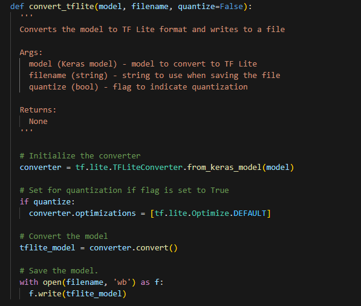
### 1.3 Show that you can execute post-training quantization on a model.
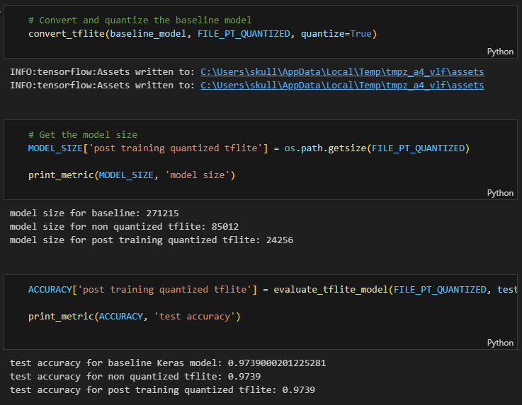
### 1.4 Show that you can train a quantization aware model.
Deze code installeert eerst de TensorFlow Model Optimization library, laadt daarna je bestaande model en herstelt de eerder opgeslagen gewichten. Vervolgens wordt het model omgezet naar een quantization-aware model, wat betekent dat het model tijdens het trainen leert omgaan met lagere precisie (bijvoorbeeld int8) zodat het later sneller en kleiner kan draaien op mobiele of edge devices.
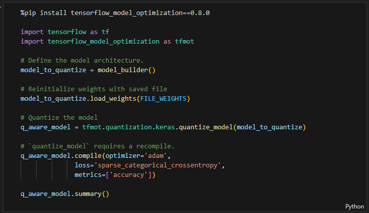
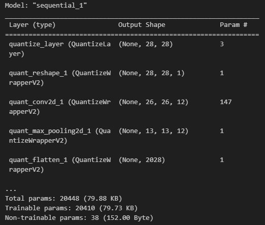

---
Daarna wordt het quantization-aware model daadwerkelijk getraind zodat het later kleiner en sneller kan draaien zonder veel nauwkeurigheid te verliezen.
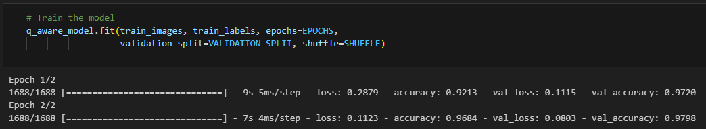

---
Vervolgens kijk je hoe goed het model is voordat het daadwerkelijk gequantizeerd wordt.

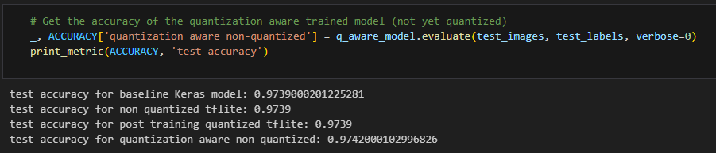

---
hier converteer je het model naar een compacte, snelle TFLite-versie en check je hoe goed het nog presteert.
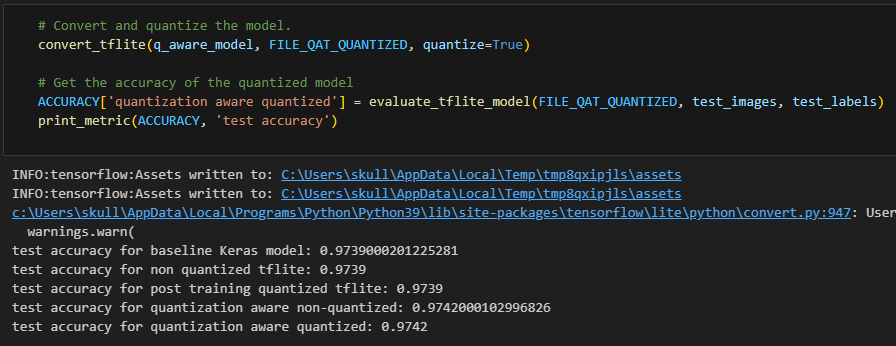

---
Ten laatste bekijk je hoe compact het TFLite-model is geworden na quantization.
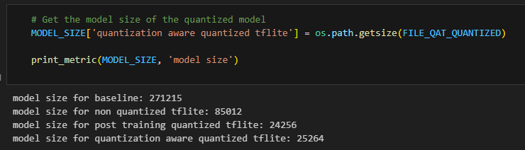

---
### 1.5 Show that you can perform weight pruning on a model.
### Voorbereiden van het model voor pruning

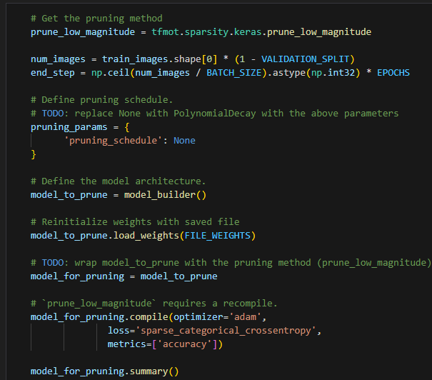
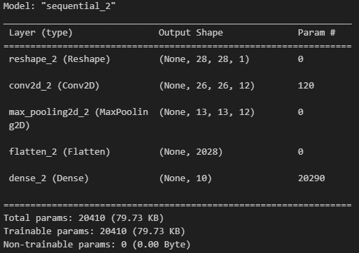

Het model wordt klaargemaakt voor weight pruning, zodat tijdens training automatisch de kleinste gewichten worden verwijderd. Dit maakt het model compacter en efficiënter. De code berekent de trainingsstappen, laadt de gewichten en compileert het model, zodat het klaar is om gepruned te worden.

De uitkomst laat zien hoe het model is opgebouwd en hoeveel parameters elke laag heeft. Het model begint met een Reshape-laag, gevolgd door een Conv2D-laag en MaxPooling, daarna een Flatten-laag en tot slot een Dense-laag met 10 output-neuronen. In totaal heeft het model 20.410 parameters die allemaal trainbaar zijn, wat neerkomt op ongeveer 80 KB. Dit geeft een idee van de complexiteit en grootte van het netwerk.

---

### Inspectie van modelgewichten

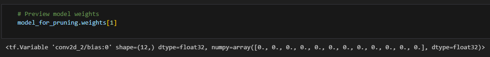

Hier kunnen we één van de gewichten van het model bekijken, in dit geval de tweede set gewichten (weights[1]). Dit geeft inzicht in de daadwerkelijke getallen die het model gebruikt om berekeningen te doen en kan nuttig zijn om te controleren of pruning of andere aanpassingen effect hebben gehad.

---

### Training van het geprunde model

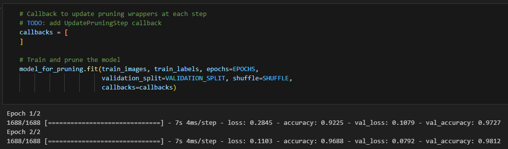

Het model wordt getraind terwijl het gepruned kan worden. Een UpdatePruningStep callback kan toegevoegd worden om ervoor te zorgen dat de pruning-lagen tijdens training de kleinste gewichten geleidelijk verwijderen. Zo wordt het model tijdens training compacter en efficiënter, terwijl het nog steeds leert van de data.

---

### Inspectie van bias-waarden

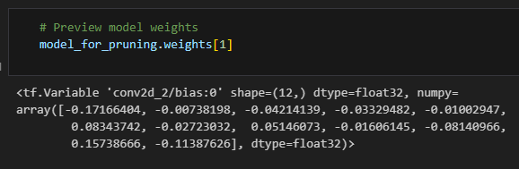

Hier zien we de bias-waarden van de tweede laag (Conv2D) van het model. Er is een array van 12 getallen, één voor elke output-kanaal van de convolutielaag. Dit laat zien hoe het model zijn output aanpast voordat activatiefuncties worden toegepast, en kan later gebruikt worden om veranderingen door pruning of training te controleren.

---

### Verwijderen van pruning-wrappers

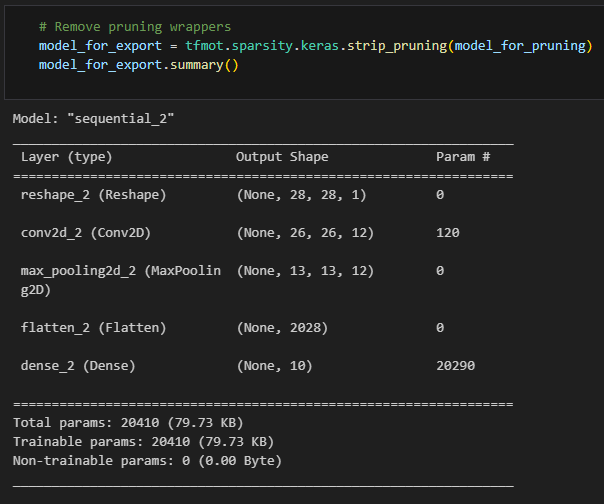

De pruning-wrappers worden verwijderd zodat het model geëxporteerd of geconverteerd kan worden naar TFLite zonder extra pruning-logica. Het model behoudt dezelfde architectuur en parameters, maar de interne pruning-lagen zijn verwijderd, waardoor het model eenvoudiger en efficiënter kan worden gebruikt voor inferentie.

---

### Inspectie van kernel-gewichten

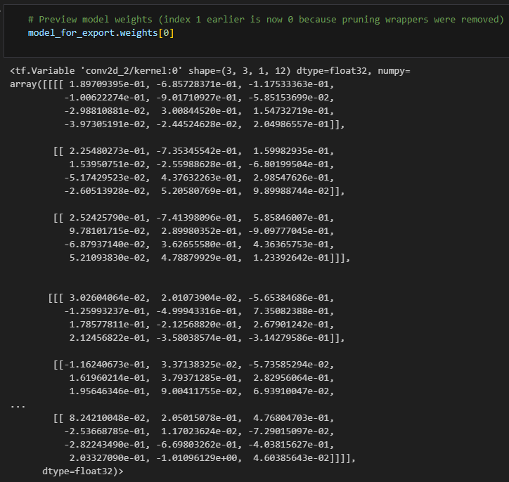
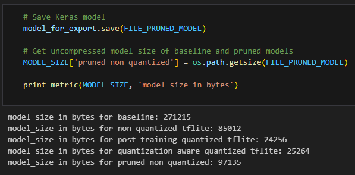

We bekijken de kerngewichten (kernel) van de eerste laag van het geëxporteerde model, die oorspronkelijk de tweede laag (Conv2D) was. Het is een 4D-array die de filters van de convolutielaag bevat en laat zien welke waarden de filters gebruiken om kenmerken uit de inputbeelden te detecteren. Dit zijn de daadwerkelijke getrainde waarden die tijdens inferentie worden gebruikt.

---

### Modelgrootte vergelijken

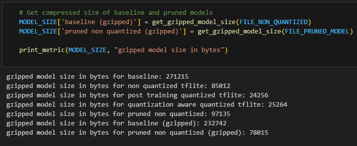

De bestandsgrootte van de verschillende modellen wordt vergeleken. Het originele Keras-model is het grootst. Het TFLite-model zonder quantization is al veel kleiner, en met post-training quantization of quantization-aware training wordt het nog compacter. Het geprunde, maar niet-gequantizeerde model is 97 KB, wat laat zien dat pruning het model ook aanzienlijk verkleint, maar quantization heeft het grootste effect op de bestandsgrootte.

---

### Comprimeren van modellen met gzip

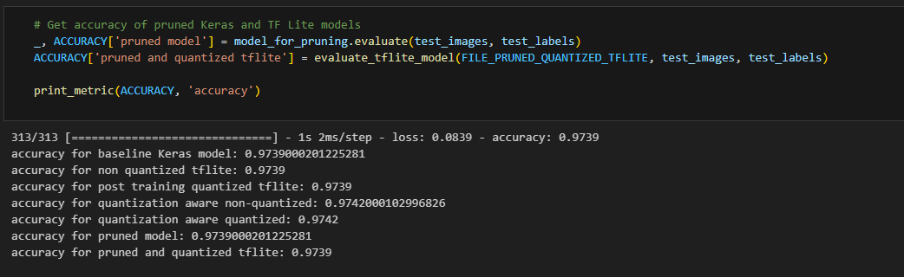

De modellen worden gecomprimeerd met gzip. Het originele baseline-model gaat van 271 KB naar ongeveer 233 KB. Het geprunde, maar niet-gequantizeerde model verkleint van 97 KB naar ongeveer 78 KB. Dit laat zien dat pruning en compressie samen het model nog compacter maken, terwijl quantization meestal het grootste effect op de bestandsgrootte heeft.

Tot slot meten we hoe goed de geprunde modellen presteren op de testdata. Eerst wordt de nauwkeurigheid van het geprunde Keras-model berekend, daarna van het model dat zowel gepruned als gequantizeerd is in TFLite-formaat. Zo kunnen we vergelijken hoeveel impact pruning en quantization hebben gehad op de prestaties van het model.

---

### 1.6 Show that you wrote an elaborate lab report in Markdown and pushed it to the repository.

#### - 1.6.1 What is the role of model_builder(): how does it differ from building a model manually?
model_builder() is een functie die een vooraf gedefinieerde modelarchitectuur retourneert. Het voordeel is dat je niet elke laag handmatig hoeft te definiëren bij elke keer dat je een model wilt trainen; je kunt eenvoudig het model hergebruiken door model_builder() aan te roepen. Dit maakt je code overzichtelijker en herbruikbaar, vooral in labs of scripts waar je dezelfde architectuur meerdere keren nodig hebt.

#### - 1.6.2 What is the purpose of the TensorFlow Lite format? How does it differ from the TensorFlow format?
TensorFlow Lite is bedoeld om modellen te draaien op mobiele apparaten en embedded systemen. Het verschilt van het standaard TensorFlow-formaat doordat het kleiner is, minder geheugen gebruikt, en geoptimaliseerd is voor snelle inferentie op apparaten met beperkte rekenkracht. TensorFlow-modellen zijn vaak groter en vereisen de volledige runtime, terwijl TFLite een lichte runtime gebruikt.

#### - 1.6.3 What changes in the model's layers after making it quantization aware?
Na quantization-aware training worden de lagen van het model aangepast zodat ze rekening houden met lagere precisie tijdens training, zoals int8 in plaats van float32. Dit gebeurt via extra "fake quantization"-operaties in de lagen, die simuleren hoe het model presteert in een gequantizeerde omgeving. De architectuur blijft hetzelfde, maar intern worden de activaties en gewichten voorbereid op quantization.

#### - 1.6.4 What is quantization and pruning?
Quantization is het proces waarbij de precisie van gewichten en activaties wordt verlaagd (bijvoorbeeld van float32 naar int8) om het model kleiner en sneller te maken.
Pruning verwijst naar het verwijderen van kleine of weinig belangrijke gewichten in het netwerk, waardoor het model compacter wordt en minder berekeningen nodig heeft, zonder veel prestatieverlies.

#### - 1.6.5 Why should you use quantization aware training instead of simply quantizing a model after training?
Bij quantization na training kan de nauwkeurigheid soms flink dalen, omdat het model nooit heeft geleerd om met lagere precisie te werken. Quantization-aware training laat het model tijdens training rekening houden met de lagere precisie, waardoor het beter bestand is tegen de afrondingsfouten die ontstaan bij quantization.

#### - 1.6.6 When do you see a difference in the model's size when using quantization: after conversion to TFLite or after model compression using gzip? Why is that?
Het grootste verschil in grootte door quantization zie je na conversie naar TFLite. Dit komt omdat quantization de getallen zelf verkleint (bv. van 32-bit float naar 8-bit int), waardoor het bestand intrinsiek kleiner wordt. Gzip kan dit nog iets verkleinen, maar de meeste winst komt al door de lagere precisie.

#### - 1.6.7 And when in the case of pruning: after conversion or after compression? Why is that?
Bij pruning zie je het verschil vaak pas echt na compressie. Pruning verwijdert veel kleine gewichten die nog steeds als getallen in het bestand worden opgeslagen, waardoor het model op zich niet veel kleiner wordt. Pas na compressie (zoals gzip) worden de nullen en herhalende patronen in de gewichten efficiënt opgeslagen, waardoor het bestand kleiner wordt.

#### - 1.6.8 What is the role of the sparsity and step parameters in the PolynomialDecay function?
sparsity bepaalt het uiteindelijke percentage gewichten dat gepruned zal worden.
step geeft aan bij welke stap van de training de pruning-progressie wordt bijgewerkt. Samen zorgen ze ervoor dat pruning geleidelijk en gecontroleerd plaatsvindt, in plaats van in één keer veel gewichten te verwijderen.

#### - 1.6.9 Why do we need to remove the pruning layer before saving the model?
De pruning-lagen zijn alleen nodig tijdens training om gewichten dynamisch te verwijderen. Voor inferentie zijn ze niet nodig en zouden ze het model alleen maar complexer maken. Door de pruning-layers te verwijderen, wordt het model eenvoudiger, sneller en compatibel met TFLite of andere deployment-formaten.

### Conclusion:

In deze opdracht hebben we geleerd hoe we een Keras/TensorFlow-model kunnen optimaliseren voor apparaten met beperkte rekenkracht. We hebben gezien dat quantization en pruning het model aanzienlijk kleiner en sneller maken, zonder dat de nauwkeurigheid veel achteruitgaat. Quantization-aware training helpt om de prestaties beter te behouden dan simpelweg quantizen na training, terwijl pruning vooral effectief is in combinatie met compressie om de bestandsgrootte te verkleinen. Uiteindelijk blijkt dat het mogelijk is om een model zowel compact als efficiënt te maken, waardoor het geschikt wordt voor mobiele en embedded toepassingen, terwijl de testnauwkeurigheid grotendeels behouden blijft.

## Reflection

### What was difficult?
er was niks echt moeilijk, het ging redelijk vlot.

### What was easy?
De taak was zeer leerrijk en gemakelijk om door te lopen.

### What did I learn?
ik heb geleerd hoe quantization en pruning een model kunnen optimaliseren. Ik begrijp nu het verschil tussen post-training quantization en quantization-aware training en waarom pruning samen met compressie het model kleiner kan maken zonder grote verliezen. Ook heb ik inzicht gekregen in hoe de interne gewichten en biases van een model veranderen door deze optimalisaties.

### What would I do differently?
Niks, de taak was redelijk overzichtelijk en niet complex.
