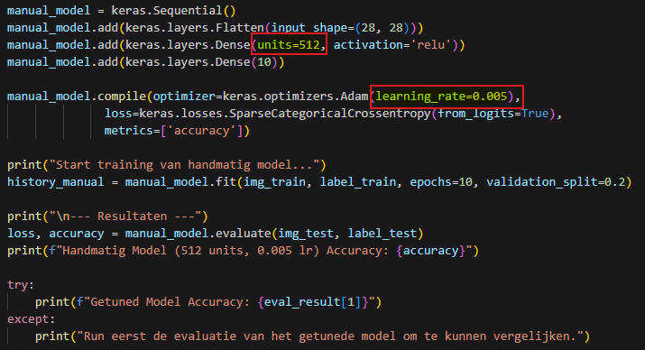
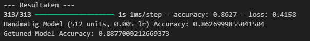
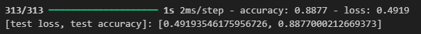
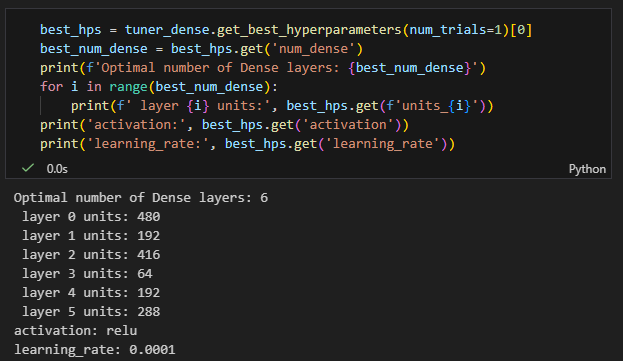
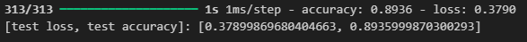

# Lab Rapport: Hyperparameter-tuning

## Student information

- Student naam: Gauthier Vandeputte
- Student code: 202397621

## Assignment description

Tijdens deze opdracht heb ik leren gebruik maken van de Tuner library, daar hebben we hyperparameter tuning gebruikt op neurale netwerken. Ik heb ook RnadomSearch en Hyberband tuners gebruikt.
## Proof of work done

### 1.2 Show that you have completed the tuning tutorials and pushed the notebooks to the repository

### 1.3 Show that you have also edited/added/executed code when asked
#### 1.3.1 train the model without hyperparameter tuning using the following parameters: units = 512 & learning_rate = 0.005

Deze code traint eigenlijk gewoon een simpel neuraal netwerk dat cijfers uit het MNIST-dataset moet herkennen. Eerst wordt een model opgebouwd dat de 28×28-pixels van elke afbeelding plat maakt, daarna een laag toevoegt met 512 neuronen die proberen kenmerken te leren, en tenslotte een laag met 10 outputs,één voor elk cijfer van 0 tot 9. Het model wordt getraind met de Adam-optimizer (met een learning rate van 0.005) en een loss-functie die past bij labels die gewoon nummers zijn in plaats van one-hot vectors.

Daarna laat de code het model tien epochs trainen, waarbij 20% van de trainingsdata wordt gebruikt als validatieset. Als het trainen klaar is, wordt het model getest op de aparte testset en wordt de accuracy uitgeprint. Helemaal op het einde probeert de code ook de accuracy van een eerder getuned model te tonen, maar alleen als die variabele al bestaat; anders krijg je een melding dat je dat getunede model eerst nog moet evalueren.
#### resultaten zonder tuning

#### resultaten met tuning

#### conclusie
Aan de hand van tuning kunnen we afleiden dat het model 2,5% beter presteert. door de vaste waarden te gebruiken maken we eigenlijk een soort van "gok". maar deze gok presteert slechter. Daarom gebruik je best parameter-tuning om de beste waardes te vinden.

#### Extra: Determine the optimal number of `Dense` layers you can add to improve the model.
Als mijn extra, heb ik gekozen om ook het optimaal aantal Dense Layers te vinden om het model te verbeteren. hiervan is dit de uitkomst dat het aantal Dense layers 6 zou moeten zijn.

Als we dan ons model opnieuw laten trainen is er ook duidelijk een prestatie verschil. Het model presteert nog beter.

### 1.6 Show that you wrote an elaborate lab report in Markdown and pushed it to the repository
#### 1.6.1 What is the role of `model_builder()`: how does it differ from building a model manually? What is the function of `hp.Choice()`? What is the difference with `hp.Int()`?
De model_builder() is een functie die een gecompileerd keras model terug geeft. Het is een soort blauwdruk voor de keras tuner. Het verschil met het zelf te maken is dat het hyperparameter object als argument accepteert. Binnen deze functie definieer je geen vaste waarden, maar de zoekruimte waarbinnen de tuner moet zoeken. bv manueel geef je untis = 512.

De functie hp.Choice() definieert een hyperparameter die een waarde moet kiezen uit een vaste lijst van opties. Dit is nuttig voor parameters zoals: relu of tanh.

De functie hp.Int() definieert een integer hyperparameter binnen een bepaald bereik en met een vaste stapgrootte. Het verschil tussen Int en Choice is dat het definieert een bereik in plaats van een vaste set opties. De tuner zal zoeken naar de optimale integer binnen de grenzen.
#### 1.6.2 Why do we use `tf.keras.callbacks.EarlyStopping()`?
Dit wordt gebruikt om overfitting van het model te voorkomen en om onnodige rekentijd te besparen.

#### 1.6.3 Do you see a difference? Which model (with/without hyperparameter tuning) does the best job? How can you prove this?
Als we kijken naar de geteste nauwkeurigheid kunnen we zien dat het handmatig model 86.27 procent accuraat is en de getunede model 88.77 procent accuraat is. Hier uit kunnen we  afleiden dat met tuning het model een stuk beter presteerd dan zonder tuning.
#### 1.6.4 Whats the difference between `max_trials` and `executions_per_trial`?
Max_trials definieert de breedte van de zoektocht. Het maximale aantal uniek hyperparametercombinaties dat de Tuner in totaal zal testen. De executions_per_trial definieert de diepte van de zoektocht. Dit wordt  gebruikt om de resultaten te middelen en de impact van willekeurige factoren te verminderen. Het aantal keer dat elke unieke hyperparametercombinatie wordt getrained.

#### 1.6.5 What are the (dis)advantages of using `HyperModel` instead of `build_model()`?
HyperModel biedt een betere modulariteit en herbruikbaarheid. Het geeft je een volledige controle over de tuning-workflow door de build() en fit() methode aant te passen.
#### 1.6.6 Why would you use `hp.get()`?
Om de uiteindelijke, optimate parameterwaarde op te halen nadet de zoektocht is voltooid.
#### 1.6.7 When can you use `HyperResNet` and `HyperXception`? What are they?
Deze zijn voorgedefinieerde HyperModel klasses binnen de Keras Tuner die zin ontworpen om de architectuur van CNNs te optimaliseren. Je kan ze gebruiken wanneer je niet het basismodel wilt tunen, maar de hyperparameter tuning wilt gebruiken op de structuur van de netwerken. De tuner zoekt dan bijvoorbeeld naar de optimale diepte, breedte en aantal lagen van de resnet of xception architectuur.

### Conclusion:
Door gebruik te maken van parameter tuning heb ik ontdekt dat getrainde modellen beter presteren en je dit het beste gebruikt om modellen te trainen. Handmatig een model trainen is goed, maar niet optimaal. Daarom gebruik je tuning.

## Reflection

### What was difficult?

Ik heb vooral het probleem dat ik soms in de verkeerde versie van python zit of neit goed weet welke versie ik nu moet gebruiken en verlies daar vaak veel tijd aan.

### What was easy?

Het volgen van de tutorials ging redelijk vlot.

### What did I learn?

Ik heb geleerd hoe je de tuner library moet gebruiken. Waarom tuning nodig is en hoe de werking er van werkt. ook is er duidelijk een verschil tussen modellen zonder en modellen met tuning.

### What would I do differently?

/

## Resources
- [Introduction to the Keras Tuner](https://www.tensorflow.org/tutorials/keras/keras_tuner)
- [Getting started with Keras Tuner](https://keras.io/guides/keras_tuner/getting_started/)
- [Visualize the hyperparameter tuning process](https://keras.io/guides/keras_tuner/visualize_tuning/)
